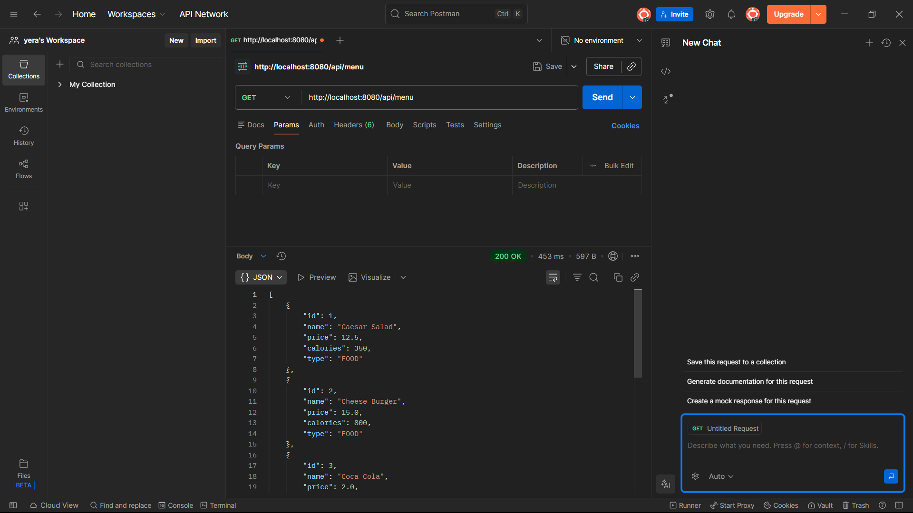
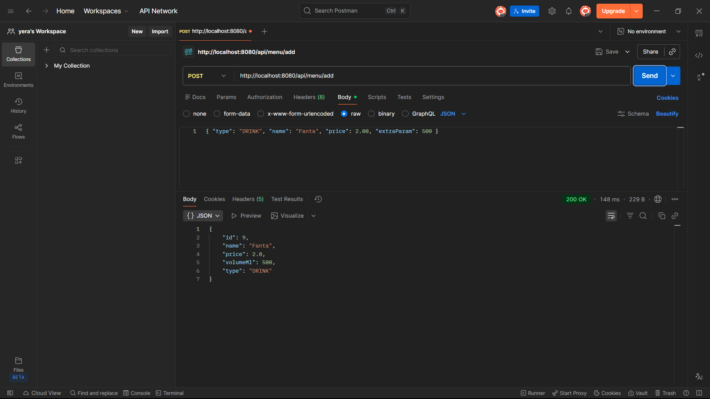
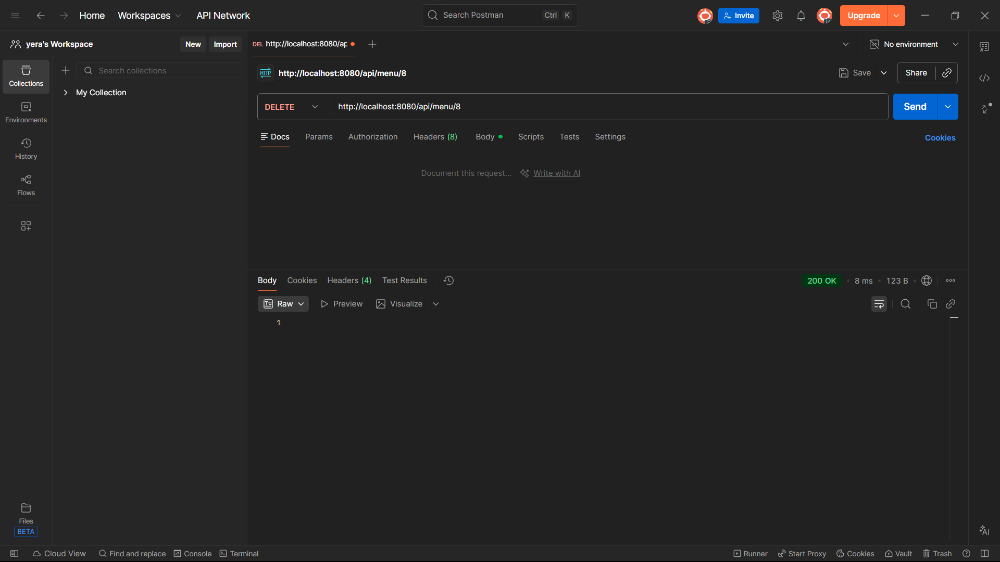
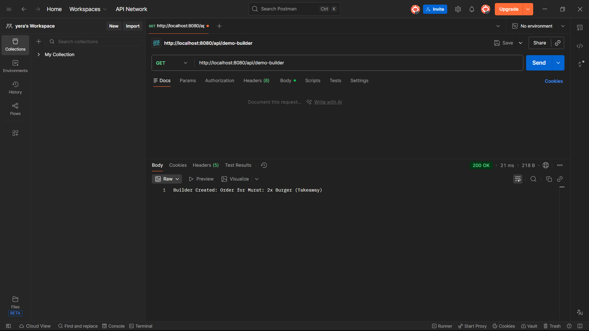
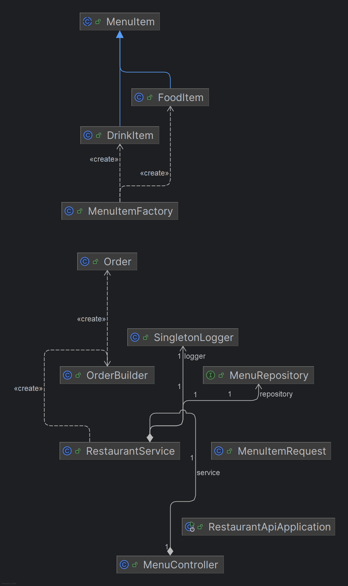

# Restaurant REST API (Endterm Project)

## A. Project Overview
This project is an upgrade of my previous Restaurant System. I migrated the project to **Spring Boot** and created a **RESTful API**. Now it uses a PostgreSQL database, follows SOLID principles, and implements Design Patterns like Singleton, Factory, and Builder.

## B. REST API Documentation

### 1. Get All Items
Shows the full list of the menu.
* **URL:** `http://localhost:8080/api/menu`
* **Method:** `GET`
* **Response Example:**
```json
[
    {
        "id": 1,
        "name": "Caesar Salad",
        "price": 12.5,
        "type": "FOOD",
        "calories": 350
    }
]
```

### 2. Add New Item
   Adds a new Food or Drink to the database.

* **URL:** `http://localhost:8080/api/menu/add`

* **Method:** `POST`

* **Body Example:**
```json
[
    {
        "type": "FOOD",
        "name": "Super Shawarma",
        "price": 8.50,
        "extraParam": 600
    }
]
```

### 3. Delete Item
Deletes an item by its ID.

* **URL:** `http://localhost:8080/api/menu/{id}`

* **Method:** `DELETE`

* **Response:** `200 OK`
  
### 4. Demo Builder Pattern
Demonstrates how the Builder pattern creates an order.

* **URL:** `http://localhost:8080/api/demo-builder`
* **Method:** `GET`
* 

## C. Design Patterns Section
I used three main patterns in this project:

1. **Singleton:** Used in `SingletonLogger.java`. It ensures we have only one logger instance for the whole application.

2. **Factory:** Used in `MenuItemFactory.java`. It encapsulates the logic of creating objects. It decides whether to create a FoodItem or DrinkItem based on the input string.

3. **Builder:** Used in `OrderBuilder.java`. It helps to construct complex Order objects step-by-step (e.g., adding customer name, then dish, then quantity).

## D. Component Principles Section
My project follows these principles to be modular and clean:

* **REP** (Reuse/Release Equivalence Principle):** I organized classes into logical packages (`controller`, `service`, `repository`). Each layer can be reused.

* **CCP (Common Closure Principle):** Classes that change together are packaged together. For example, `FoodItem` and `DrinkItem` are both in the `model` package.

## E. SOLID & OOP Summary
I followed **SOLID principles** to make the code maintainable:

* **SRP (Single Responsibility):** Every class has one job. `MenuController` handles web requests, `RestaurantService` handles logic.

* **OCP (Open/Closed):** I can add new menu types (like `DessertItem`) by extending `MenuItem` without changing the Service code.

* **LSP (Liskov Substitution):** `FoodItem` and `DrinkItem` can be used anywhere where `MenuItem` is expected.

### OOP Features:

* **Inheritance:** `FoodItem` extends `MenuItem`.

* **Polymorphism:** The list `List<MenuItem>` can store both food and drinks.

## F. Database Schema
I use **PostgreSQL**. The project uses the **Single Table** strategy.

* **Table:** `menu_items`

* **Columns:**

    * `id` (Primary Key)

    * `name` (Unique)

    * `price`

    * `item_type` (Discriminator: "FOOD" or "DRINK")

    * `calories` (Only for Food)

    * `volume_ml` (Only for Drinks)

## G. System Architecture Diagram
Here is the UML diagram showing the structure of my classes and their relationships:

## H. Instructions to Run the Spring Boot Application
1. **Database:** Make sure PostgreSQL is running and you have a database named `restaurant_db`.

2. **Config:** Check `src/main/resources/application.properties` and update your username/password if needed.

3. **Run:** Open `RestaurantApiApplication.java` in IntelliJ IDEA and click the Green Play button.

4. **Test:** Open Postman or Browser and go to `http://localhost:8080/api/menu`.
## I. Reflection Section
#### What I learned:

* learned how to migrate a console app to a **Spring Boot REST API**.

* I understood how **JPA/Hibernate** saves me time by writing SQL queries automatically.

* I practiced using **Postman** to test POST and DELETE requests.

* I learned how to implement **Design Patterns** (Singleton, Factory, Builder) in a real project.

#### Challenges:

* It was difficult to understand how to connect the Database correctly in `application.properties`.

* Understanding the Builder pattern was a bit tricky at first, but now I see how useful it is for complex objects.